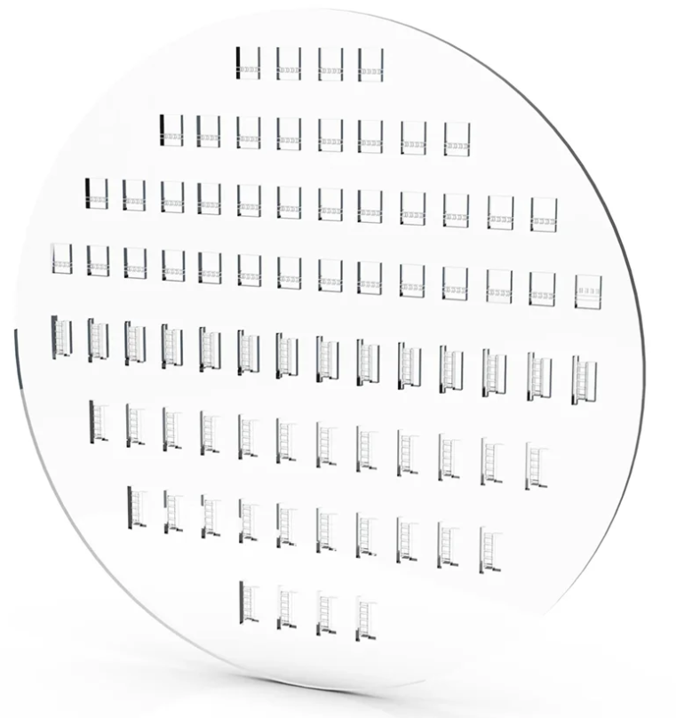

# Design, Fabrication, and Characterization of Femtosecond Laser-Written All-Glass Vapor Cells for Integrated Photonics Applications


---

<div align="center">
  
  <p><em>Laser-Written All-Glass Vapor Cells (LWVC) on glass substrate for quantum and photonic integrated circuits.</em></p>
</div>

---

### 📌 Overview & Abstract

This repository contains the full Master's Thesis documentation, experimental protocols, and research results focused on the development of integrated atomic vapor cells fabricated via **femtosecond laser micromachining** and bonding techniques.

The primary objective of this work is to advance chip-scale optical and quantum devices—such as atomic clocks, magnetometers, and quantum memories—by integrating alkali vapor cells directly into photonic circuits.

---

### 🔬 Key Focus Areas

* ⚙️ **Design & Microfabrication:** Microchannel creation in glass substrates using Femtosecond Laser-Assisted Etching (FLICE).
* 🧪 **Experimental Characterization:** Optical spectroscopy, vapor density measurement, and long-term hermeticity testing.
* ⚛️ **Quantum Applications:** Miniaturized frequency standards, quantum sensing, and integrated photonics platforms.

---

### 📂 Repository Structure

```text
.
├── Images/              # Experimental diagrams, wafer photos, and plots
├── Data/                # Raw characterization and spectroscopy data
├── Src/                 # LaTeX source files (.tex, .bib, custom packages)
└── Master_Thesis.pdf    # Main compiled thesis document
